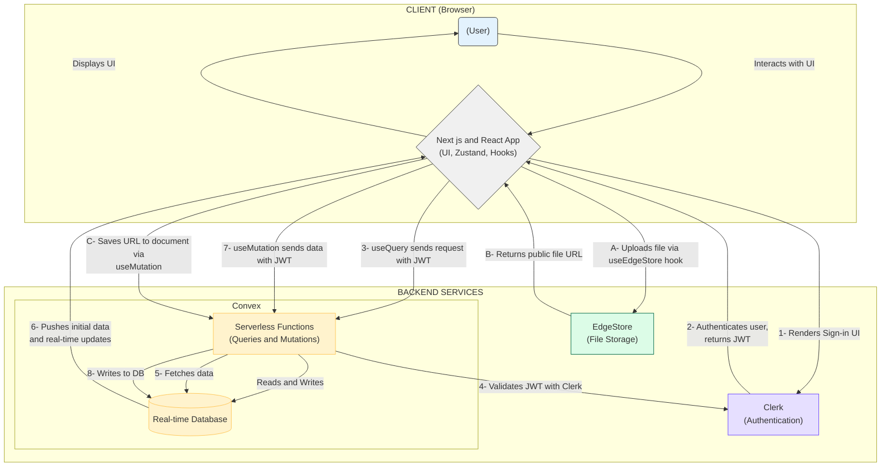

# ARCHITECTURE.md

# Jotion System Architecture

## 1. Overview

Jotion is a full-stack web application built using a modern, serverless architecture designed for real-time collaboration and scalability. It leverages specialized cloud services for distinct functionalities like backend logic, database, authentication, and file storage.

- **Client (Frontend):** A [Next.js](https://nextjs.org/) 14 application using the App Router, built with [React](https://react.dev/) and [TypeScript](https://www.typescriptlang.org/). Responsible for rendering the user interface, handling user interactions, and managing client-side state.
- **Backend & Database:** [Convex](https://convex.dev/) provides a unified backend platform, including a real-time database and serverless functions (written in TypeScript) for executing backend logic (queries and mutations).
- **Authentication:** [Clerk](https://clerk.com/) handles user management, sign-up/sign-in flows, session management, and provides JWTs for authenticating users with the Convex backend.
- **File Storage:** [EdgeStore](https://edgestore.dev/) is used for storing binary files like cover images and images uploaded within the editor. URLs provided by EdgeStore are stored in the Convex database.
- **UI/Styling:** [Tailwind CSS](https://tailwindcss.com/) provides utility classes for styling, enhanced by [Shadcn/ui](https://ui.shadcn.com/) for pre-built, customizable React components.

### Architecture Diagram



## 2. Project Folder Structure

```
notion-clone-kartikey/
├── app/                      # Next.js App Router directory
│   ├── (main)/               # Routes/components for authenticated users
│   │   ├── layout.tsx        # Main app layout (sidebar, content area)
│   │   ├── (routes)/         # Specific page routes within the main app
│   │   │   └── documents/
│   │   │       ├── page.tsx      # Default authenticated page
│   │   │       └── [documentId]/
│   │   │           └── page.tsx  # Dynamic route for viewing/editing a document
│   │   └── _components/      # Components specific to the (main) layout/routes
│   ├── (marketing)/          # Routes/components for the public landing page
│   │   ├── layout.tsx        # Marketing layout
│   │   ├── page.tsx          # Landing page content
│   │   └── _components/      # Components specific to the marketing section
│   ├── (public)/             # Routes for publicly accessible, non-marketing content
│   │   ├── layout.tsx        # Public layout
│   │   └── (routes)/
│   │       └── preview/      # Route for previewing published documents
│   │           └── [documentId]/
│   │               └── page.tsx
│   ├── api/                  # API Route Handlers
│   │   └── edgestore/        # EdgeStore endpoint handler
│   │       └── [...edgestore]/
│   │           └── route.ts
│   ├── error.tsx             # Root error boundary UI
│   ├── globals.css           # Global Tailwind styles
│   └── layout.tsx            # Root layout (providers, theme, base HTML)
├── components/               # Shared UI components used across the application
│   ├── cover.tsx             # Document cover image component
│   ├── editor.tsx            # BlockNote editor integration (dynamically loaded)
│   ├── icon-picker.tsx       # Emoji picker
│   ├── search-command.tsx    # Search modal (⌘+K)
│   ├── modals/               # Reusable modal dialogs (Confirm, CoverImage, Settings)
│   ├── providers/            # React Context providers (Convex, Theme, Modal, EdgeStore)
│   └── ui/                   # Base UI components from Shadcn/ui (Button, Input, etc.)
├── convex/                   # Convex backend functions and schema
│   ├── auth.config.js        # Configures Convex auth provider (Clerk)
│   ├── documents.ts          # Queries and Mutations for document operations
│   ├── schema.ts             # Database schema definition
│   └── _generated/           # Auto-generated Convex types and API helpers (DO NOT EDIT)
├── hooks/                    # Custom React hooks
│   ├── use-cover-image.tsx   # Zustand store/hook for cover image modal state
│   ├── use-origin.tsx        # Hook to safely get the window origin
│   ├── use-scroll-top.tsx    # Hook to detect page scroll position
│   ├── use-search.tsx        # Zustand store/hook for search modal state
│   ├── use-settings.tsx      # Zustand store/hook for settings modal state
├── lib/                      # Library code and utilities
│   ├── edgestore.ts          # EdgeStore client setup and provider export
│   └── utils.ts              # Utility functions (e.g., `cn` for class names)
├── public/                   # Static assets (images, fonts) served from the root
├── .env.local                # Environment variables (ignored by Git)
├── next.config.js            # Next.js configuration
├── package.json              # Project dependencies and scripts
├── tailwind.config.ts        # Tailwind CSS configuration
└── tsconfig.json             # TypeScript configuration
```

**Key Structure Points:**

- **Next.js App Router:** Uses file-system based routing. Folders define route segments.
- **Route Groups (`(groupName)`):** Organizes routes and applies specific layouts (`layout.tsx` within the group) without affecting the URL path (e.g., `(main)`, `(marketing)`, `(public)`). This is crucial for separating authenticated app UI, landing page UI, and public preview UI.
- **`_components` Convention:** Used within route groups to co-locate components primarily used within that specific section of the app.
- **`components/`:** Globally reusable components.
- **`components/ui/`:** Base components generated by Shadcn/ui.
- **`convex/`:** Self-contained backend logic, clearly separated from the frontend.
- **`hooks/`:** Encapsulates reusable frontend logic, including Zustand stores for managing global UI state.

## 3. Major Components

- **`app/(main)/layout.tsx`:** The main layout for authenticated users. Renders the `Navigation` sidebar and the main content area where document pages are displayed. Includes logic to redirect unauthenticated users.
- **`app/(main)/_components/Navigation.tsx`:** The collapsible and resizable sidebar. Manages document hierarchy display (`DocumentList`), user information (`UserItem`), search trigger, settings trigger, new page creation, and the trash (`TrashBox`).
- **`app/(main)/(routes)/documents/[documentId]/page.tsx`:** The dynamic page for displaying and editing a specific document. Fetches document data using `useQuery`, renders the `Toolbar`, `Cover`, and dynamically imports/renders the `Editor`.
- **`components/editor.tsx`:** Integrates the `BlockNoteView` component. Handles editor state, content changes (triggering `api.documents.update` mutation), and file uploads within the editor via `useEdgeStore`. Lazily loaded for performance.
- **`components/toolbar.tsx`:** Renders controls above the editor area, including the document title (editable), icon picker, and buttons to add/change the cover image.
- **`components/cover.tsx`:** Displays the document's cover image. Includes buttons (in non-preview mode) to change or remove the cover image via the `CoverImageModal` and `api.documents.removeCoverImage` mutation.
- **`components/search-command.tsx`:** Implements the `⌘+K` search modal using `cmdk` and fetches/filters documents via `api.documents.getSearch`.
- **`convex/documents.ts`:** Contains the core backend logic:
  - `create`: Inserts a new document.
  - `getSidebar`: Fetches documents for the sidebar hierarchy.
  - `getById`: Fetches a single document, handling authorization for published/private docs.
  - `update`: Updates various document fields (title, content, icon, coverImage, isPublished).
  - `archive`: Soft-deletes a document and its children recursively (`isArchived: true`).
  - `restore`: Restores an archived document and its children (`isArchived: false`).
  - `remove`: Permanently deletes a document.
  - `getTrash`: Fetches archived documents.
  - `getSearch`: Fetches documents for the search modal.
- **Providers (`components/providers/`):** Wrap the application in `app/layout.tsx` to provide necessary context:
  - `ConvexClientProvider`: Initializes Convex client and integrates Clerk authentication.
  - `ThemeProvider`: Manages light/dark mode using `next-themes`.
  * `ModalProvider`: Renders global modal components (Settings, Cover Image) to ensure they are mounted.
  - `EdgeStoreProvider`: Initializes the EdgeStore client context.

## 4. Data Flow

**Authentication:**

1.  User interacts with Clerk UI elements (`SignInButton`, `UserButton`) in the Next.js frontend.
2.  Clerk handles the sign-in/sign-up flow.
3.  Upon successful authentication, Clerk provides a JWT to the frontend.
4.  `ConvexProviderWithClerk` automatically attaches this JWT to requests made to Convex.
5.  Convex backend functions (`query`, `mutation`) use `ctx.auth.getUserIdentity()` to validate the JWT against the configured Clerk issuer (`convex/auth.config.js`).
6.  If valid, the identity (including user ID/`subject`) is available in the function context (`ctx`). Backend functions use this `userId` to authorize data access (e.g., ensuring a user can only modify their own documents).

**Document Fetching & Real-time Updates:**

1.  A React component (e.g., `DocumentIdPage`, `DocumentList`) calls a Convex query using the `useQuery` hook (e.g., `useQuery(api.documents.getById, { documentId })`).
2.  The hook sends the request to the corresponding Convex query function (`convex/documents.ts`).
3.  The Convex function reads data from the database (`ctx.db`) and returns it.
4.  `useQuery` provides the data to the component and subscribes to future changes related to that query.
5.  If another user (or the same user in a different tab) triggers a mutation (`useMutation(api.documents.update)`) that affects the data relevant to the initial query:
    a. The mutation function updates the Convex database.
    b. Convex detects the change and pushes the updated query results via WebSocket to all subscribed clients.
    c. The `useQuery` hook receives the new data, triggering a re-render in the component with the fresh information.

**Document Creation/Update:**

1.  User action (e.g., typing in the editor, clicking "New page") triggers an event handler.
2.  The event handler calls a Convex mutation using the `useMutation` hook (e.g., `const create = useMutation(api.documents.create)`).
3.  The hook sends the mutation request and arguments to the corresponding Convex mutation function (`convex/documents.ts`).
4.  The Convex function performs necessary logic (validation, authorization) and writes data to the database (`ctx.db.insert`, `ctx.db.patch`, `ctx.db.delete`).
5.  The mutation completes. Real-time updates (see above) handle propagating the changes to relevant components.

**File Upload (Cover Image Example):**

1.  User clicks "Add cover" or "Change cover".
2.  `CoverImageModal` opens.
3.  User drops an image into `SingleImageDropzone`.
4.  The `onChange` handler in `CoverImageModal` is triggered.
5.  It calls `edgestore.publicFiles.upload({ file, options: { replaceTargetUrl } })` using the `useEdgeStore` hook.
6.  The EdgeStore client library uploads the file directly to EdgeStore via the Next.js API route (`app/api/edgestore/[...edgestore]/route.ts`).
7.  EdgeStore returns the secure URL of the uploaded file.
8.  The `onChange` handler then calls the `api.documents.update` Convex mutation, passing the `documentId` and the `coverImage: url` received from EdgeStore.
9.  The Convex mutation updates the document record in the database with the new `coverImage` URL.
10. Real-time updates propagate the change to display the new cover image.

## 5. Design Decisions

- **Next.js App Router:** Chosen for its modern features like Server Components (though used less heavily here due to Convex handling data), Layouts, Route Groups, and improved developer experience over the Pages Router. Route groups are particularly useful for managing distinct sections (marketing, authenticated app, public previews) with different layouts.
- **Convex:** Selected as the backend/database due to its first-class support for real-time updates, serverless architecture (eliminating backend infrastructure management), tight TypeScript integration (end-to-end type safety), and built-in authentication helpers. It simplifies building collaborative features significantly compared to traditional REST/GraphQL APIs with separate databases and WebSocket servers.
- **Clerk:** Chosen for authentication because it provides a complete user management solution (UI components, session handling, JWTs, social logins) with easy integration, especially with Convex (via the JWT template). It abstracts away the complexities of building secure authentication.
- **EdgeStore:** Selected for file storage as it's a managed service specifically designed for easy integration with modern web frameworks like Next.js. It handles uploads, deletions, and provides URLs simply, integrating nicely with the serverless approach (upload logic often handled via API routes).
- **BlockNote:** A modern block-based editor library offering a Notion-like editing experience with good React integration and customization options, including file uploads.
- **Tailwind CSS + Shadcn/ui:** Tailwind provides rapid UI development with utility classes. Shadcn/ui builds on Tailwind, offering beautifully designed, accessible, and _unopinionated_ components that can be easily customized by copying their code directly into the project (`components/ui/`). This avoids style conflicts and provides full control.
- **Zustand:** Used for simple, global client-side UI state management (modal open/closed states, search state). It's lightweight and less boilerplate-heavy than Redux for managing non-server state. Convex's `useQuery`/`useMutation` handle the server state.
- **Soft Deletes (`isArchived`):** The `isArchived` flag provides a non-destructive way to delete documents, allowing for recovery via the Trash Box. This improves user experience by preventing accidental permanent data loss. Recursive logic ensures children are archived/restored correctly.
- **Dynamic Imports (`next/dynamic`):** Used for the `Editor` component to reduce the initial JavaScript bundle size, improving loading performance. The editor is only loaded when needed on document pages.
